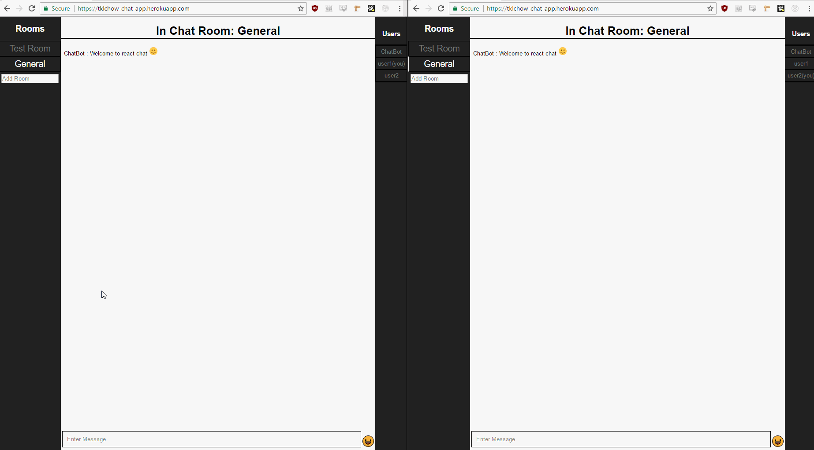

# Real-time Chat App

See live example at https://tklchow-chat-app.herokuapp.com/

## Tools used
- React + Redux
- Node + Express
- MongoDb + Mongoose

## Usage
2 Different package.json exists, one for UI, and one for server
In root
-`npm i` `npm start` to install server dependecies and start server
cd react-ui
-`npm i` `npm start` to install UI dependecies and start UI
Open at `localhost:3000`

### Long Loading Time On Initial Startup
This is an expected behavior for heroku's free-tier service. 
See https://devcenter.heroku.com/articles/dynos#dyno-idling for more info.